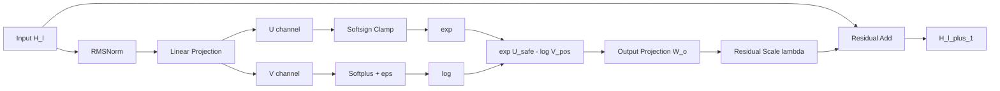

# EMLStack: Residual EML Circuit Layer

> EMLStack은 EML을 단순 activation으로 사용하는 방식이 아니라, EML node를 직접 쌓아 neural circuit layer로 구성하는 아이디어이다.

## 1. 배경

EML 논문의 기본 연산자는 다음과 같다.

$$
\mathrm{eml}(x,y)=\exp(x)-\ln(y)
$$

원 논문의 핵심 주장은 단일 이항 연산자 `eml`과 상수 `1`만으로 여러 elementary function을 구성할 수 있다는 것이다.

EML 표현은 동일한 binary node로 이루어진 tree로 볼 수 있다.

$$
S \rightarrow 1 \mid \mathrm{eml}(S,S)
$$

이 관점에서 EML은 일반적인 activation이라기보다, elementary function을 구성하는 **computation primitive**에 가깝다.

- Paper: [arXiv:2603.21852v2](https://arxiv.org/pdf/2603.21852v2)

---

## 2. 핵심 아이디어

기존 MLP는 보통 다음 구조를 따른다.

$$
H_{l+1} = \sigma(W H_l + b)
$$

즉, 선형층이 feature를 만들고 activation이 비선형성을 제공한다.

하지만 EML은 그 자체가 이미 강한 비선형 연산이다.

$$
\mathrm{eml}(u,v)=\exp(u)-\ln(v)
$$

따라서 EML을 사용할 때는 다음처럼 보는 것이 더 자연스럽다.

$$
H_l
\rightarrow
\mathrm{Linear}_{2m}(H_l)
\rightarrow
(U,V)
\rightarrow
\mathrm{EML}(U,V)
$$

즉, 선형층은 hidden feature를 직접 생성하는 것이 아니라, EML node에 입력될 ordered pair를 생성한다.

$$
[U,V] = W_p H_l + b
$$

$$
E = \mathrm{eml}(U,V)
$$

여기서 $(U,V)$는 순서쌍이다.  
EML은 일반적으로 비가환적이므로 `U`와 `V`의 역할을 구분해야 한다.

---

## 3. EMLStack Block

실제 학습에서는 순정 EML을 그대로 쓰기 어렵다.

문제는 두 가지다.

1. `exp(U)` branch는 쉽게 폭주한다.
2. `ln(V)` branch는 $V > 0$ 조건이 필요하다.

따라서 EMLStack block에서는 다음 안정화가 필요하다.

- RMSNorm
- softsign clamp
- positive transform for log branch
- small residual scale
- residual connection

전체 구조는 다음과 같다.

$$
Z_l = \mathrm{RMSNorm}(H_l)
$$

$$
[U_l,V_l] = W_p Z_l + b
$$

$$
U_{\mathrm{safe}} =
\frac{U_l}{1 + |U_l| / c}
$$

$$
V_{\mathrm{pos}} =
\mathrm{softplus}(V_l) + \epsilon
$$

$$
E_l =
\exp(U_{\mathrm{safe}})
-
\ln(V_{\mathrm{pos}})
$$

$$
H_{l+1}
=
H_l
+
\lambda_l W_o E_l
$$

전체 block을 하나의 식으로 쓰면 다음과 같다.

$$
H_{l+1}
=
H_l
+
\lambda_l W_o
\left[
\exp\left(
\frac{U_l}{1+|U_l|/c}
\right)
-
\ln\left(
\mathrm{softplus}(V_l)+\epsilon
\right)
\right]
$$

where

$$
[U_l,V_l]=W_p\mathrm{RMSNorm}(H_l)+b
$$

---

## 4. 구조 다이어그램



---

## 5. 왜 activation을 쓰지 않는가

EMLStack에서는 ReLU, GELU, SiLU 같은 pointwise activation이 필요하지 않다.

기존 구조는 다음과 같다.

$$
\mathrm{Linear} \rightarrow \mathrm{Activation}
$$

EMLStack에서는 다음 구조를 사용한다.

$$
\mathrm{Linear}_{2m} \rightarrow (U,V) \rightarrow \mathrm{EML}(U,V)
$$

EML 자체가 exponential branch와 logarithmic branch를 갖기 때문에, 별도의 activation을 추가하면 비선형성이 중복된다.

| 기존 MLP | EMLStack |
|---|---|
| Linear가 hidden feature 생성 | Linear가 EML 입력 pair 생성 |
| Activation이 비선형성 제공 | EML node가 비선형성 제공 |
| pointwise activation 사용 | binary operation 사용 |
| feature vector 중심 | circuit state 중심 |
| 해석성 낮음 | 중간 EML node를 수식 후보로 해석 가능 |

---

## 6. 왜 residual이 중요한가

EMLStack에서 residual은 선택사항이 아니다. 거의 필수다.

순수하게 다음처럼 구성하면 불안정하다.

$$
H_{l+1}=\mathrm{EMLBlock}(H_l)
$$

이 경우 각 layer가 전체 representation을 덮어쓴다.  
EML은 `exp`와 `log` 때문에 scale 변화가 매우 크므로, 깊게 쌓으면 학습이 쉽게 터질 수 있다.

따라서 다음 형태가 더 적절하다.

$$
H_{l+1}=H_l+\lambda_l\Delta H_l
$$

여기서 EML block은 전체 표현을 새로 만드는 것이 아니라, 기존 표현에 작은 symbolic correction을 추가한다.

residual이 중요한 이유는 다음과 같다.

1. identity path가 살아 있어 학습이 안정된다.
2. gradient highway가 생긴다.
3. EML node가 feature constructor처럼 작동한다.
4. hardening 또는 snap 과정에서 성능 붕괴가 줄어든다.
5. tree가 아니라 reusable circuit 또는 DAG 구조에 가까워진다.

---

## 7. Softsign Clamp

`exp(U)` branch는 반드시 제어해야 한다.

가장 단순한 방법은 hard clamp다.

$$
U_{\mathrm{safe}}=\mathrm{clip}(U,-c,c)
$$

하지만 hard clamp는 경계에서 gradient가 끊긴다.

또 다른 방법은 `tanh` clamp다.

$$
U_{\mathrm{safe}}=c\mathrm{tanh}(U/c)
$$

하지만 `tanh`는 포화가 빠르다.

따라서 EMLStack에서는 softsign clamp가 더 적절하다.

$$
U_{\mathrm{safe}}
=
\frac{U}{1+|U|/c}
$$

이 방식은 $U_{\mathrm{safe}}\in(-c,c)$를 보장하면서도, `tanh`보다 gradient가 천천히 감소한다.

| 방식 | 장점 | 단점 |
|---|---|---|
| no clamp | 표현력 최대 | exp 폭주 |
| hard clamp | 폭주 방지 | 경계에서 gradient 단절 |
| tanh clamp | 부드러운 제한 | 포화가 빠름 |
| softsign clamp | 부드럽고 포화가 느림 | 큰 입력에서 gradient 감소 |

초기값은 다음 정도가 적절하다.

$$
c = 3 \sim 5
$$

---

## 8. Log Branch 안정화

순정 EML은 다음 항을 포함한다.

$$
-\ln(V)
$$

하지만 선형층 출력 $V$는 음수가 될 수 있다.  
따라서 실수 영역에서 안정적으로 계산하려면 $V>0$을 보장해야 한다.

이를 위해 다음 변환을 사용한다.

$$
V_{\mathrm{pos}}=\mathrm{softplus}(V)+\epsilon
$$

그리고 EML branch는 다음처럼 계산한다.

$$
E=\exp(U_{\mathrm{safe}})-\ln(V_{\mathrm{pos}})
$$

여기서 $\epsilon$은 작은 양수다.

예시:

$$
\epsilon=10^{-4}
$$

---

## 9. PyTorch 구현

```python
import torch
import torch.nn as nn
import torch.nn.functional as F


class RMSNorm(nn.Module):
    def __init__(self, dim: int, eps: float = 1e-8):
        super().__init__()
        self.weight = nn.Parameter(torch.ones(dim))
        self.eps = eps

    def forward(self, x: torch.Tensor) -> torch.Tensor:
        rms = x.pow(2).mean(dim=-1, keepdim=True).add(self.eps).sqrt()
        return self.weight * x / rms


def softsign_clip(x: torch.Tensor, c: float) -> torch.Tensor:
    return x / (1.0 + x.abs() / c)


class EMLResidualBlock(nn.Module):
    def __init__(
        self,
        dim: int,
        width: int | None = None,
        c: float = 5.0,
        eps: float = 1e-4,
        init_scale: float = 1e-3,
    ):
        super().__init__()

        width = width or dim

        self.norm = RMSNorm(dim)
        self.pair_proj = nn.Linear(dim, 2 * width)
        self.out_proj = nn.Linear(width, dim)

        self.c = c
        self.eps = eps
        self.res_scale = nn.Parameter(torch.tensor(init_scale))

    def forward(self, h: torch.Tensor) -> torch.Tensor:
        z = self.norm(h)

        pair = self.pair_proj(z)
        u, v = pair.chunk(2, dim=-1)

        u_safe = softsign_clip(u, self.c)
        v_pos = F.softplus(v) + self.eps

        e = torch.exp(u_safe) - torch.log(v_pos)

        return h + self.res_scale * self.out_proj(e)
```

---

## 10. EMLStack Model 예시

```python
class EMLStack(nn.Module):
    def __init__(
        self,
        dim: int,
        depth: int,
        width: int | None = None,
        c: float = 5.0,
        eps: float = 1e-4,
        init_scale: float = 1e-3,
    ):
        super().__init__()

        self.blocks = nn.ModuleList([
            EMLResidualBlock(
                dim=dim,
                width=width,
                c=c,
                eps=eps,
                init_scale=init_scale,
            )
            for _ in range(depth)
        ])

    def forward(self, h: torch.Tensor) -> torch.Tensor:
        for block in self.blocks:
            h = block(h)
        return h
```

---

## 11. 연구 기여 포인트

단순히 “EML을 neural layer로 만들었다”는 것만으로는 약하다.

유의미한 기여가 되려면 기존 EML tree search가 어려운 함수군에서 EMLStack이 더 잘 작동한다는 것을 보여야 한다.

핵심 차이는 다음이다.

$$
\mathrm{tree\ search}
\rightarrow
\mathrm{circuit\ learning}
$$

기존 EML tree는 중간식을 재사용하지 못한다.  
같은 subexpression이 여러 번 필요하면 tree 내부에 계속 복사해야 한다.

반면 EMLStack은 중간 feature를 channel에 저장하고 다음 layer에서 재사용할 수 있다.  
즉 EMLStack은 tree가 아니라 DAG 또는 circuit에 가깝다.

핵심 claim은 다음과 같다.

> EMLStack converts EML symbolic regression from deep tree search into residual circuit learning with reusable intermediate features.

또는:

> EMLStack learns tree-hard but circuit-easy elementary functions.

---

## 12. Benchmark 설계

### 12.1 Shared Subexpression Family

가장 중요한 benchmark는 shared subexpression이 많은 함수군이다.

먼저 중간식을 정의한다.

$$
g(x,y)=\mathrm{eml}(x,y)
$$

그리고 이 $g$를 여러 번 재사용하는 target function을 만든다.

$$
f_k(x,y)
=
\sum_{i=1}^{k}
a_i
\left[
\exp(\alpha_i g(x,y))
-
\ln(\beta_i+\gamma_i g(x,y)^2)
\right]
$$

여기서 기존 tree는 $g(x,y)$를 여러 branch에 반복 복사해야 한다.

반면 EMLStack은 다음처럼 처리할 수 있다.

1. 첫 layer에서 $g(x,y)$ 생성
2. 다음 layer에서 $g$ channel 재사용
3. 여러 EML branch 병렬 계산
4. output projection으로 합성

이 benchmark는 EMLStack의 circuit-like 구조를 가장 잘 보여준다.

---

### 12.2 Deep EML Chain

깊은 EML tree 탐색 한계를 직접 찌르는 benchmark다.

$$
g_0(x,y)=x
$$

$$
g_{t+1}(x,y)
=
\mathrm{eml}(s(g_t),y)
$$

where

$$
s(z)=\frac{z}{1+|z|/c}
$$

최종 target은 다음과 같다.

$$
f_L(x,y)=g_L(x,y)
$$

이 함수군은 depth가 커질수록 기존 EML tree search가 어려워진다.

다만 이 benchmark는 target generator가 EMLStack 구조와 너무 가까워 보일 수 있으므로, 주 실험보다는 보조 실험으로 두는 것이 좋다.

---

### 12.3 Low-Depth Circuit, High-Size Tree

중간식을 여러 번 재사용하는 circuit target을 구성한다.

$$
z_1=\mathrm{eml}(x,y)
$$

$$
z_2=\mathrm{eml}(z_1,1)
$$

$$
z_3=\mathrm{eml}(1,z_1)
$$

$$
z_4=\mathrm{eml}(z_2,z_3)
$$

$$
f(x,y)=w_1z_1+w_2z_2+w_3z_3+w_4z_4
$$

EMLStack에서는 $z_1,z_2,z_3,z_4$가 channel로 남아 재사용될 수 있다.

하지만 pure EML tree에서는 중간식을 재사용하지 못하므로 expression size가 커진다.

---

## 13. 평가 지표

train MSE만 보면 안 된다.  
일반 MLP도 interpolation은 잘할 수 있다.

중요한 지표는 다음이다.

| Metric | Description |
|---|---|
| interpolation MSE | 학습 범위 안에서의 오차 |
| extrapolation MSE | 학습 범위 밖에서의 오차 |
| snap 후 MSE | symbolic hardening 이후 오차 |
| recovery rate | seed별 성공률 |
| NaN/overflow rate | 수치 안정성 |
| effective tree size | 같은 함수를 tree로 표현할 때 필요한 크기 |
| circuit depth/width | EMLStack에서 필요한 depth와 width |

가장 중요한 지표는 다음이다.

$$
\mathrm{snap\ after\ extrapolation\ MSE}
$$

또는 더 명확히:

$$
\mathrm{extrapolation\ MSE\ after\ snap}
$$

---

## 14. Baseline

비교 대상은 다음이 적절하다.

| Baseline | Purpose |
|---|---|
| MLP + GELU | 일반 neural approximation baseline |
| KAN | function-learning baseline |
| PySR | symbolic regression baseline |
| 원 논문식 EML tree | 직접적인 EML baseline |
| EMLStack | 제안 모델 |

---

## 15. 요약

EMLStack의 핵심은 다음과 같다.

$$
\mathrm{EMLStack\ is\ not\ an\ activation\ replacement.}
$$

$$
\mathrm{EMLStack\ is\ a\ trainable\ elementary\ function\ circuit\ layer.}
$$

구조는 다음과 같다.

$$
\mathrm{RMSNorm}
\rightarrow
\mathrm{Linear}_{2m}
\rightarrow
(U,V)
\rightarrow
\mathrm{softsign\ stabilized\ EML}
\rightarrow
\mathrm{small\ residual\ update}
$$

기여 포인트는 다음이다.

$$
\mathrm{tree\ hard}
\rightarrow
\mathrm{circuit\ easy}
$$

즉, EMLStack의 목적은 GELU나 ReLU를 대체하는 것이 아니다.  
목적은 EML 기반 symbolic regression을 deep tree search에서 residual circuit learning으로 바꾸는 것이다.
